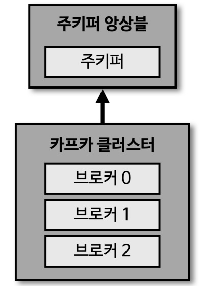
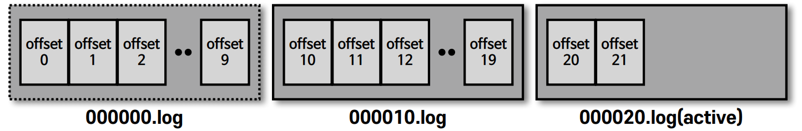
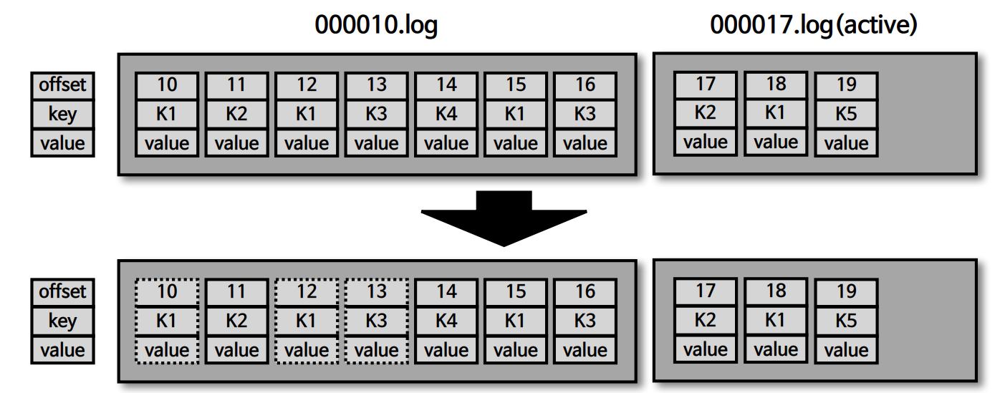
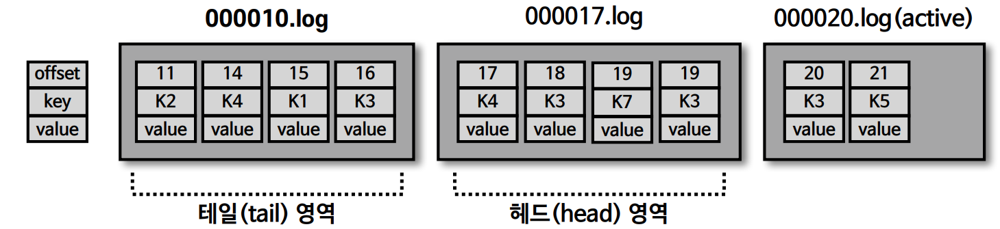
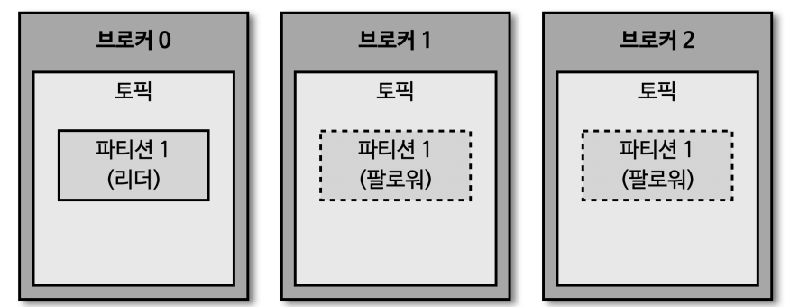

# 카프카 기본 개념

## 카프카 브로커와 클러스터

- 주키퍼
    - 카프카 클러스터를 운영하기 위해 반드시 필요한 어플리케이션
    - 주키퍼의 서로 다른 `znode`에 각각 클러스터를 지정하여 여러개의 클러스터를 연결할 수 있음
    - 카프카 3.0 부터는 주키퍼가 없어도 클러스터 동작 가능
- 카프카 클러스터
    - 카프카 클러스터는 여러개의 브로커로 이루어져 있음
    - 하나의 브로커는 한 개의 서버나 인스턴스에서 동작하게 된다
- 브로커
    - 데이터를 분산 저장하여 안전하게 사용할 수 있도록 도와주는 어플리케이션
    - 일반적으로 하나의 서버에는 한개의 브로커 프로세스가 실행
    - 1대로도 기본 기능이 실행되지만, 데이터를 안전하게 보관 처리하기 위해 3대 이상의 브로커를 권장

## 브로커의 역할

### 컨트롤러

- 클러스터 내 다수의 브로커 중 한 대는 컨트롤러 역할을 담당
- 다른 브로커들의 상태 확인
- 문제가 생긴 브로커는 클러스터에서 제거
- 컨트롤러 역할의 브로커에 문제가 생기면 다른 브로커가 컨트롤러 역할을 담당 

### 데이터 삭제

- 브로커가 `로그 세그먼트` 단위로 데이터를 삭제
- 일정 시간이나 용량, 또는 특정한 상황에 따라 삭제

### 컨슈머 오프셋 저장

- 토픽에 있는 데이터를 컨슈머가 가져왔을 때, 컨슈머가 어느 오프셋까지 처리했는지를 저장
- 컨슈머는 어느 레코드까지 가져갔는지 확인하기 위해 오프셋을 커밋

### 그룹 코디네이터

- 컨슈머 그룹의 상태를 체크하고 파티션을 컨슈머와 매칭되도록 분배
- 파티션을 컨슈머로 재할당하는 과정을 리밸런스

### 데이터의 저장

- 카프카를 실행할 때 `config/server.properties` 내 `log.dir` 옵션에 정의한 디렉토리에 데이터를 저장
- 토픽의 이름과 파티션 번호의 조합으로 하위 디렉토리를 생성해 데이터를 저장
  - `log`에는 메시지와 메타데이터를 저장
  - `index`는 메시지의 오프셋을 인덱싱한 정보
  - `timeindex`는 메시지에 포함된 timestamp 값을 기준으로 인덱싱한 정보
- 메시지는 프로듀서가 보낸 레코드 하나의 데이터
- 로그 세그먼트
  - log.segment.bytes
    - 바이트 단위의 최대 세그먼트 크기 지정
    - 디폴트는 1GB
  - log.roll.ms(hours)
    - 세그먼트가 신규 생성된 이후 다음 파일로 넘어가는 시간
    - 디폴트는 7일
  - 파일에 만들어지는 가장 최종의 오프셋 번호가 log 파일 이름이 된다
    - 즉 00010.log 이면 10번 레코드 부터 데이터가 저장되어 있다고 유추 가능하다
  - 가장 마지막 세그먼트, 즉 쓰기가 일어나고 있는 파일을 `Active Segment`라고 부르며 브로커의 삭제 대상에 포함되지 않는다
  - `retention` 옵션에 따라 삭제 대상으로 지정

## 세그먼트와 삭제 주기

### cleanup.policy = delete

액티브가 아닌 세그먼트를 기준으로 파일 시스템 내 세그먼트 로그가 삭제

- retention.ms(minutes, hours)
  - 세그먼트를 보유할 최대 기간
  - 토픽의 데이터양이 많아지게 되면 이를 낮추는걸 고려해야 함
  - 디폴트는 7일(일반적으로 3일)
- retention.bytes
  - 파티션당 로그 적재 바이트 값
  - 디폴트는 -1(지정하지 않음)
- log.retention.check.interval.ms
  - 브로커는 세그먼트가 삭제영역에 들어왔는지 확인하는 간격
  - 디폴트는 5분

카프카에서 데이터는 세그먼트 단위로 삭제하기에 레코드 단위(개별 단위)로는 삭제가 불가능하다.
또한, 이미 적재된 레코드의 메시지 키, 값, 오프셋, 헤더 등에수정 또한 불가능하다.
따라서, 프로듀서가 데이터를 적재할 때나 컨슈머가 데이터를 사용할 때 데이터를 검증하는 것이 좋다

### cleanup.policy = compact

레코드에는 메시지 키(key)와 메시지 값(value)가 존재하는데, 메시지 키별로 오래된 데이터를 삭제하는 정책.
그렇기 때문에 `delete`와 다르게 일부 레코드만 삭제가 될 수 있다. 이 역시 액티브 세그먼트를 제외한 데이터를 대상으로 한다

- 테일 영역
  - 압축 정책에 의해 압축이 완료된 레코드들
  - `클린로그`라고도 하며 `중복된 메시지 키가 없다`
- 헤드 영역
  - 압축 정책이 되기전 레코드들.
  - `더티로그`라고도 하며 `중복된 메시지 키가 있다`
- min.cleanable.dirty.ratio
  - 테일영역과 헤드영역의 레코드 영역의 비율에 따라서 압축을 수행하는 옵션
  - 0.5로 설정한다면 테일과 헤드의 레코드 갯수가 동일할 경우 압축이 진행된다
  - 이 값은 높으면 압축 효과가 좋지만, 0.9 비율이 되기까지 용량을 차지하므로 용량효율에서는 떨어진다
  - 반면 이 값이 낮으면 가장 최신 데이터를 유지할 수 있지만, 잦은 압축으로 인해 브로커에 부담을 줄 수 있다
R
## 복제(Replication)

브로커의 역할 중 데이터 복제는 카프카를 운용함에 있어 가장 중요한 부분이다. 카프카를 장애 허용 시스템(fault tolerant system)
으로 동작할 수 있게 해주는 원동력이다.

- 클러스터로 묶인 브로커 중 일부에 장애가 발생하더라도 데이터를 유실하지 않게 해준다
- 파티션의 복제 단위는 `파티션(Partition)`
- 토픽을 생성할 떄 파티션의 복제 갯수(Replication factor)를 설정할 수 있다
  - 만약 직접 옵션을 설정하지 않는다면, 브로커에 설정된 옵션 값을 따른다
  - 복제 갯수의 최소값은 1이며 복제 없음, 최대값은 브로커의 갯수
  - 상용 환경에서는 2~3으로 설정
  - 상황에 따라 유실되어도 상관없거나 처리 속도가 중요하다면 1~2

### 리더(Leader)와 팔로워(Follower)

카프카에서 복제된 파티션은 리더와 팔로워로 구성된다.

- 리더
  - 프로듀서와 컨슈머와 직접적으로 통신하는 파티션
- 팔로워
  - 리더의 데이터가 추가되면 데이터를 복제해가는 파티션
  - 리더 파티션에 레코드가 추가되면 오프셋이 증가하게되는데, 팔로워 파티션은 현재 자신의 오프셋과 다른 부분을 가져와 저장한다
- 복제 갯수만큼 저장 용량이 증가하는 단점이 존재한다
  - 하지만, 복제를 통해 데이터를 안전하게 사용할 수 있다는 장점이 있기에 운영에서는 2이상의 복제 갯수를 정하는 것이 좋다

### 브로커에 장애가 발생하는 경우

프로듀서와 컨슈머는 오로지 리더 파티션과 통신을 한다. 
따라서, 리더 파티션에 장애가 발생하게 되면 더이상 프로듀서나 컨슈머로 부터 데이터를 받거나 줄 수 없게된다.
이 경우, 팔로워 파티션 중 하나가 리더 파티션의 지위로 `승급`하게 된다.

### In Sync Replicas(ISR)

리더와 팔로워가 모두 싱크가 된 상태, 즉 오프셋의 갯수가 동일한 상태이다.
일반적인 ISR 상태에서 리더 파티션에 문제가 생긴다면 다른 팔로워 파티션이 리더로 승급하게되어 문제가 없다.
하지만 ISR 상태가 아닌 경우, 새로운 리더로 승급되는 팔로워 파티션에 미처 복제하지 못한 데이터가 존재할 수 있다.

- unclean.leader.election.enable
  - true
    - 데이터 유실을 감수한다
    - 즉, 데이터 유실을 감수하더라도, 복제가 안된 팔로워 파티션을 승급 시킨다
  - false
    - 데이터 유실을 감수하지 않는다
    - 즉, ISR 상태인 브로커가 복구될 때 까지 중단한다
- 이 또한 토픽단위로 설정할 수 있다.

