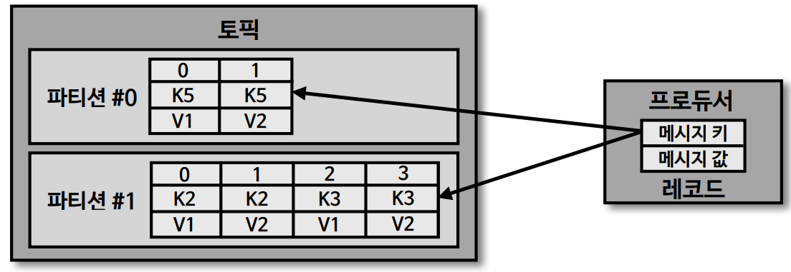
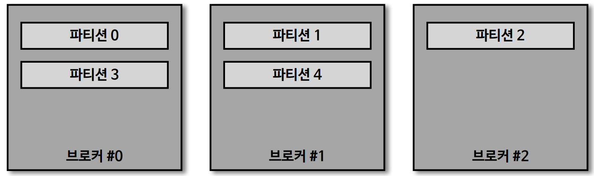
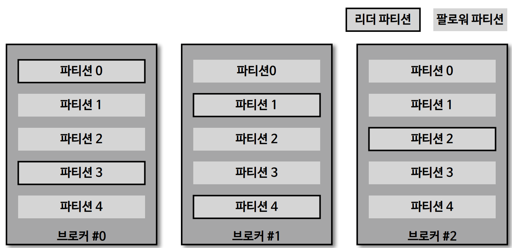
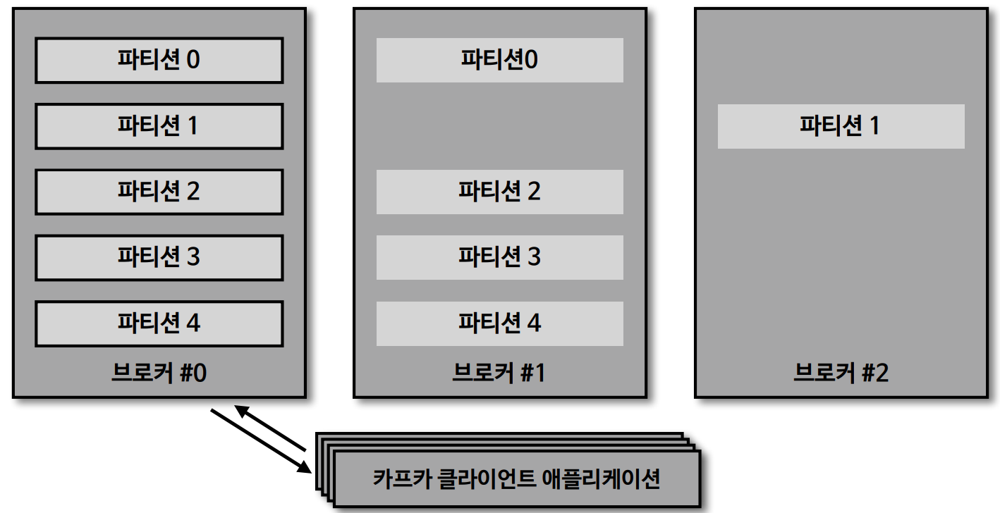
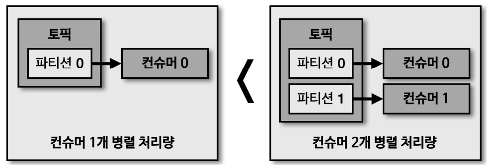
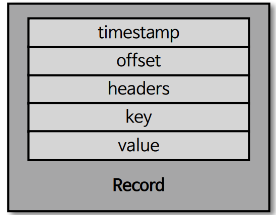

# Topic, Partition, Record

## 토픽(Topic)과 파티션(Partition)

`토픽`은 카프카에서 데이터를 구분하기 위한 단위이며, 토픽은 적어도 한개 이상의 파티션으로 구성되어 있고
각각의 `파티션`은 큐와 비슷한 구조로 이루어져 있다.
데이터가 들어갈 땐 프로듀셔가 `레코드`를 만들어서 각각의 파티션에 데이터를 전송하게되면 오프셋이 신규로 생성되고 파티션에 데이터가 저장된다.

- First In First Out(FIFO)
    - 일반적인 큐 구조
- 하지만, 데이터를 가져가는 pop 동작이 진행되어도 데이터가 삭제되지 않고 유지되는 특징
- 그렇기에 여러 컨슈머 그룹이 토픽의 데이터를 여러번 가져갈 수 있다

### 토픽 생성시 파티션이 배치되는 방법

브로커가 3개, 파티션이 5개인 토픽을 생성하는 경우 위와 같이 라운드 로빈 방식으로 파티션들이 생성된다.
여기서 중요한건 이 다섯개의 파티션은 `리더 파티션`이라는 점이다.
앞서 언급했듯이 리더 파티션은 통신을 담당하기에 데이터가 분산되어 있어 여러 데이터에 균등하게 데이터 처리량을 가져갈 수 있다.
이를 통해, 특정 서버에 통신이 집중되는 현상(hot spot) 현상을 막고 선형 확장을 통해 데이터가 많아지더라도 대응이 가능하다.

이후 팔로워 파티션들은 각각의 브로커에 복제되어 파티션에 배치되게 된다.

하지만 위와 같이 한쪽 브로커에 리더 파티션이 집중되는 현상이 발생할 수 있다.
이렇게 되면 모든 프로듀서나 컨슈머 어플리케이션들이 한쪽 브로커와만 통신하게 되어 프로세스 리소스가 몰릴 수 있다.
이 경우, `kafka-reassign-partitions.sh`와 같은 명령으로 파티션을 재분배할 수 있다.

### 파티션 갯수와 컨슈머 갯수의 처리량

파티션과 컨슈머의 관계는 일반적으로 1:1의 관계이기에 컨슈머의 데이터 처리량을 늘리기 위해서는
파티션의 갯수와 컨슈머의 갯수를 추가적으로 늘려줘야한다.
파티션은 오로지 컨슈머 하나와 매칭되지만, 컨슈머는 여러 개의 파티션을 할당해서 데이터 처리는 가능하지만 
1:1로 매칭하는게 병렬처리량이 늘어 날 수 있다.

### 파티션 갯수를 줄이는 것은 불가능

일단 한번 파티션의 갯수를 늘리고 나면 줄이는 것은 불가능하다. 앞서 언급햇듯 카프카는 파일시스템을 이용해 디스크에
파티션의 정보를 저장하고 있기에 디렉토리를 합치고 조합하는 과정이 필요하기에 이런 파티션 갯수 줄이는 것이 불가능하다.
따라서 파티션을 늘리는 작업은 신중하게 결정해야한다.

## 레코드

레코드는 위와 같이 `타임스탬프, 헤더, 메시지 키, 값, 오프셋`으로 구성되어 있다.
프로듀서가 생성한 레코드가 `브로커로 전송되어 저장될 때 오프셋이 지정`되며 옵션에 따라 타임스탬프가 저장된다.
즉, 기본적으로 프로듀서는 오프셋을 가지고 있지 않고 레코드가 브로커에 저장될 때만 오프셋이 존재한다.
브로커에 적재된 데이터는 수정할 수 없고 앞서 언급햇듯 `로그 리텐션 기간 또는 용량`에 따라 삭제된다

### 타임스탬프(Timestamp)

`스트림 프로세싱`에서 활용하기 위해 시간을 저장하는 용도로 사용된다.
프로듀서에서 따로 설정하지 않으면 ProducerRecord 생성 시간(CreationTime)이 들어가게 되거나, 브로커 적재시간(LogAppendTime)
으로 설정 할 수 있다. 이러한 옵션은 `토픽단위`로 설정 가능하다

### 오프셋(Offset)

프로듀서가 생성한 레코드에는 존재하지 않으며, 0부터 시작되고 1씩 증가된다.
컨슈머는 오프셋을 기반으로 `처리 완료된 데이터`와 `처리해야할 데이터`를 구분한다.
컨슈머에서 중복처리를 방지하기위한 중요한 목적으로 사용된다.

### 헤더(Header)

key, value 데이터를 추가할 수 있고, 레코드의 스키마 버젼이나 포맷과 같이 데이터 프로세싱에 참고할만한 정보를 담아서 사용할 수 있다.
Http Header 와 같은 유사한 용도로 볼 수 있다.

### 메시지 키(Key)

카프카에 있는 독특한 데이터 처리 방식 중 하나라고 볼 수 있다. 실제 데이터를 처리하기 위한 용도가 아닌 분류를 위한 용도이다.
이러한 용도를 파티셔닝(Partitioning)이라고 하며, 파티셔닝에 사용되는 메시지 키는 프로듀서가 데이터를 보낼 때,
파티셔너에 따라서 토픽의 파티션 번호가 지정된다.

- 필수는 아니며 기본적으로 `null`로 설정된다
- 이 경우 라운드로빈으로 순회하며 전달된다.
- null 이 아닌 메시지는 해쉬값에 의해 특정 파티션에 매핑되어 전달된다.
- 순서를 보장하거나 데이터를 분류해서 처리할 때 메시지 키를 넣어서 활용한다

### 메시지 값(Value)

실질적으로 처리할 데이터가 담기는 공간이다. 사용자에 의해 지정되며 다양한 형태로 사용가능하다.
브로커에 저장된 레코드의 값은 어떤 포맷으로 되어있는지 컨슈머 입장에선 알 수 없기 떄문에, 컨슈머 입장에서는 
미리 역직렬화 포맷을 알고 있어야한다.
보통 String 으로 많이 사용하기도 한다.

## 토픽 이름 제약 조건

- 빈 문자열은 지원하지 않는다
- 영어 대, 소문자, 숫자, 마침표(.), 언더바(_), 하이픈(-) 조합으로 생성할 수 있다.
- 카프카 내부로직 관리 목적으로 사용되는 2개 토픽으로는 생성 불가
  - `_consumer_offsets`
  - `_transaction_state`
- 카프카 내부 로직 떄문에 토픽 이름에 마침표와 언더바가 동시에 들어가면 안된다
  - 생성은 가능하지만 사용시 이슈가 발생할 수 있다.

### 의미있는 토픽이름 작성법

- 변수 선언과 같이 토픽이름을 모호하게 작성하면 유지보수에 어려움이 있을 수 있다
  - 토픽이름에 대한 규칙을 사전에 정의하고 구성원들이 그 규칙을 따라야한다
- 카프카는 `토픽 이름 변경을 지원하지 않는다`
- 규칙을 따르지 않는 토픽에 대해 사용여부를 판단
  - 단발성 토픽은 삭제 처리하고 실제 사용토픽은 삭제 후 신규 토픽을 만드는 것을 권장

### 토픽 작명의 템플릿

- <환경>.<팀-명>.<어플리케이션-명>.<메시지타입>
  - prd.marketing-team.sms-platform.json
- <프로젝트-명>.<서비스-명>.<환경>.<이벤트-명>
  - commerce.payment.prd.notification
- <환경>.<서비스-명>.<이슈번호>.<메시지타입>
  - dev.email-sender.jira-1234.email-vo-custom
- <카프카-클러스터-명>.<환경>.<서비스-명>.<메시지타입>
  - aws-kafka.live.marketing-platform.json

## 토픽을 생성하는 두 가지 방법

1. kafka-topic.sh
   - CLI 를 통해 명시적으로 토픽을 생성하는 것
   - 토픽을 효과적으로 유지보수하기 위해서는 토픽을 명시적으로 생성하는 것을 추천
2. 카프카 컨슈머 또는 프로듀서가 브로커에 생성되지 않은 토픽에 대해 데이터를 요청할 때
   - 토픽이 기본 설정으로 생성된다
   - 파티션의 갯수나 옵션 설정이 불가능