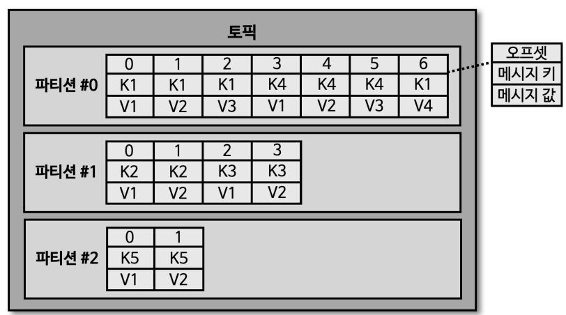

# Kafka CLI

카프카를 운영할 때 가장 많이 접하는 도구이며, 카프카 브로커 운영에 필요한 다양한 명령을 내릴 수 있다.
필수 옵션과 선택 옵션으로 나눌 수 있다. 선택 옵션의 경우 지정하지 않을 시, 기본 설정값 또는 CLI 의 기본값으로 설정된다.

## 로컬에서 카프카 브로커 실행

1. 카프카 바이너리 파일 다운로드
2. 바이너리 압축 해제
3. 주키퍼 실행
   - 상용 환경에서는 앙상블로 따로 설치해서 진행되는게 일반적
   - 주키퍼에서는 일반적으로 3개 이상의 서버에서 앙상블로 묶어서 운영하는게 일반적
   - `bin/zookeeper-server-start.sh config/zookeeper.properties`
4. 카프카 바이너리 실행
   - `bin/kafka-server-start.sh config/server.properties`
   - 카프카 서버라는 것은 브로커다
- 카프카 정상 실행 여부확인
  - `bin/kafka-broker-api-versions.sh --bootstrap-server localhost:9092`
  - `bin/kafka-topics.sh --bootstrap-server localhost:9092 --list`
    - 로컬호스트에 실행된 카프카 브로커에서 카프카 토픽의 리스트를 가져옴

### server.properties

broker.id=0  
num.network.threads=3  
num.io.threads=8  
listeners=PLAINTEXT://localhost:9092 # 카프카 브로커가 통신을 통해서 우리가 받을 ip  
socket.send.buffer.bytes=102400  
socket.receive.buffer.bytes=102400  
socket.request.max.bytes=104857600  
log.dirs=/C:\kafka_2.12-2.8.2\data  # 브로커에 데이터가 파일 시스템에 지정되 부분  
num.partitions=1  # 파티션을 만들 때 기본적으로 만들 갯수  
num.recovery.threads.per.data.dir=1  
offsets.topic.replication.factor=1  
transaction.state.log.replication.factor=1  
transaction.state.log.min.isr=1  
log.retention.hours=168  # 세그먼트 삭제 시간   
log.segment.bytes=1073741824  # 세그먼트 삭제 바이트  
log.retention.check.interval.ms=300000  # 세그먼트 체크 시간  
zookeeper.connect=localhost:2181  # 주키퍼 관련 설정  
zookeeper.connection.timeout.ms=18000  
group.initial.rebalance.delay.ms=0  

## kafka-topics.sh

클러스터와 정보와 토픽 이름만으로 토픽을 생성할 수 있다.

- 필수 값
  - 클러스터 정보
  - 토픽 이름
- 선택 값
  - 파티션 갯수
  - 복제 갯수 등
- 필수값만을 이용한 생성
  - `bin/kafka-topics.sh --create --bootstrap-server localhost:9092 --topic hello.kafka`
- 정보 확인
  - `bin/kafka-topic.sh --bootstrap-server localhost:9092 --topic hello.decribe --describe`
- 파티션 갯수 늘리기
  - 데이터 처리량을 늘리기 위한 방법(+ 컨슈머 갯수 늘리기) 
  - `bin/kafka-topic.sh --bootstrap-server localhost:9092 --topic hello.kafka --alter --partitions 4`
  - 단 파티션 갯수는 늘릴 수 있지만 줄일 수 없으므로, 토픽을 새로 만드는 방법이 좋다
  - 따라서 파티션 갯수를 줄여야 할 경우가 없는지를 항상 고려하고 늘려야한다

## kafka-configs.sh

토픽의 일부 옵션을 설정하기 위해선 `config.sh`를 통해 가능하다. `--alter`와 `--add-config` 옵션을 통해
`min.insync.replicas`와 같은 옵션을 토픽별로 설정 가능하다

- 브로커에 저장되어 있는 `server.properties`를 각종 기본값을 --broker, --all, --describe 옵션을 사용해 조회 가능
  - `/bin/kafka-config.sh --bootstrap-server localhost:9092 --borker 0 --all --describe`
- min.insync.replicas
  - 프로듀셔로 데이터를 보낼 때, 컨슈머가 데이터를 읽을 때 워터마크 용도로 사용
  - 얼마나 안전하게 데이터를 보내야하는지에 대해서 설정할 떄 사용
- 기존 토픽에 설정 추가
  - `/bin/kafka-config.sh --bootstrap-server localhost:9092 --alter --add-config min.insync.replicas=2 --topic test`

## kafka-console-producer.sh

카프카에 있는 토픽에 데이터를 테스트 용도로 사용하는데 많이 사용된다. 키보드를 통해 문자를 작성하고 엔터를 누르면 메시지 값이 전송된다

- 전송
  - `bin/kafka-conosle-producer.sh --bootstrap-server localhost:9092 --topic hello.kafka`
- 메시지 키도 같이 보내는 방법
  - `key.separator`와 함께 몇가지 추가 옵션이 필요
  - ```shell
    bin/kafka-conosle-producer.sh --bootstrap-server localhost:9092 \
    --topic hello.kafka \
    --property "parse.key=true" \
    --property "key.separator=:"
    ```

### 메시지 키와 메시지 값이 포함된 레코드가 파티션에 전송될 때

<p align="center"></p>

메시지 키가 있는 경우 동일한 메시지 키의 경우 동일한 파티션에 존재하게 된다. 예를 들어 `K1` 메시지 키는 다른 파티션엔 존재하지 않는다.
하지만, 다른 메시지 키의 경우 다른 메시지 키를 가진 데이터가 존재할 수 있다.

- 중요한 부분은 레코드가 파티션으로 전송될 때 `동일한 메시지 키의 데이터가 한 개의 파티션에 동일하게 들어간다는 점`이다.
  - 동일한 메시지 키를 가지는 레코드에 대해서는 순서를 지킬 수 있다는 게 핵심
  - 컨슈머 입장에서는 파티션을 보통 1:1 관계로 가져가게 되는데, 동일한 메시지 키에 대해서는 순서를 지키며 데이터를 처리할 수 있다
- 메시지 키가 없는 경우 null 로 저장되며, 파티션에 라운드 로빈 방식으로 전송한다
