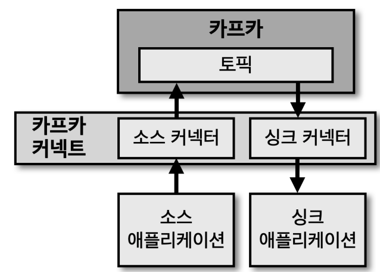
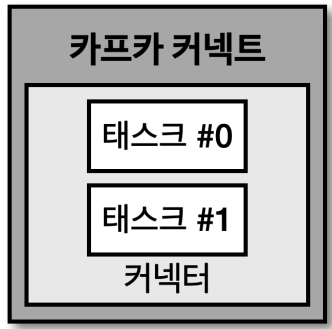
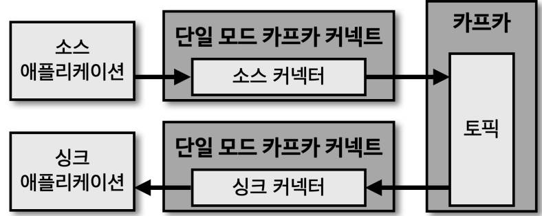
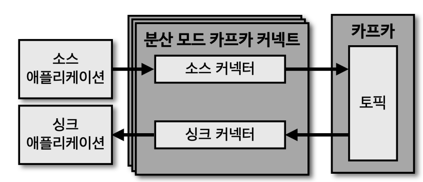
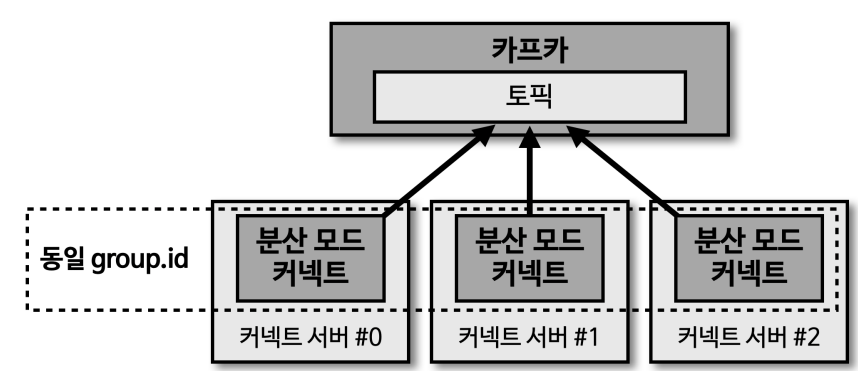
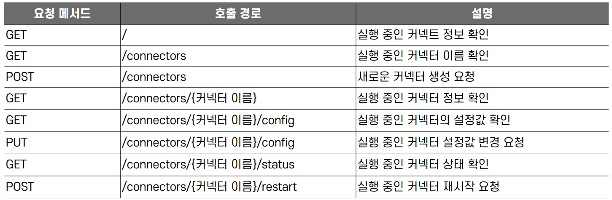
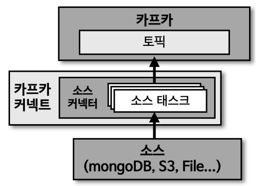
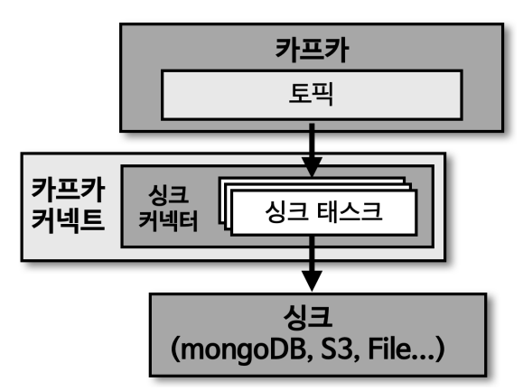

# Kafka Connect

보통 토픽에 데이터를 넣거나 뺼 때 프로듀서나 컨슈머를 사용하게 된다.
하지만, 카프카 커넥트를 사용하게 되면 만들어둔 템플릿형태로 코드를 작성 후, 필요에 따라 데이터 파이프라인을 만들어
반복적으로 수행 가능하다.

## Internal

- 카프카 커넥트 내에는 커넥터가 있고, 그 내부에는 테스크가 존재한다
  - 카프카 스트림즈에서도 마찬가지로 위와 같은 구조로 되어있음
- 즉, `실질적으로 데이터를 처리`하는 쓰레드가 `테스크` 쓰레드
- `커넥트 쓰레드`는 테스크가 몇 개 뜨는지, 각 테스크에서 설정을 어떻게 할 것인지에 대한 `오케스트레이션` 담당

## Connector

### 소스 커넥터

- 프로듀서 역할
- 특정 DB나 어플로부터 토픽에 데이터를 넣는 역할

### 싱크 커넥터

- 컨슈머 역할
- 특정 토픽에 있는 데이터를 DB에 넣거나 어떤 행위를 하는 파이프라인

## 커넥트 실행법

### 단일 모드(standalone)

- 단일 어플리케이션으로 실행
- 보통 커넥터가 쓰레드로 하나만 실행하는 모드
- 고가용성 구성이 되지 않기에 단일 장애점(SPOF: Single Point Of Failure)이 될 수 있음
- 중요도가 낮은 파이프라인을 운영할 때만 사용

### 분산 모드(distributed)

- 2대 이상의 서버에서 클러스터 형태로 운영
- 데이터 처리량의 변화에 유연하게 대응할 수 있음
- 단일모드 커넥트 대비 안전하게 운영 가능

### 커넥트 REST API 인터페이스

- 커넥트는 8083 포트로 호출할 수 있으며, HTTP 메서드 기반 API 를 제공

## 커스텀 커넥터

### 커스텀 소스 커넥터

- 소스 커넥터는 특정 파일이나 데이터를 토픽으로 데이터를 보내는 역할
  - 즉, 프로듀서의 역할
- 라이선스 문제나 로직이 원하는 요구사항과 맞지 않는 경우 직접 개발
- `SourceConnector`와 `SourceTask` 클래스를 사용하여 구현
  - 구현 후 jar 파일로 만들고 커넥트를 실행 시, 플러그인으로 추가
  - SourceConnector
    - 테스크를 실행하기 전 설정파일을 초기화하고 어떤 테스크 클래스를 사용할지 정의
    - 실질적인 데이터를 다루지 않음
  - SourceTask
    - 소스 어플리케이션 또는 소스 파일로부터 데이터를 가져와서 토픽으로 보내는 역할
    - 토픽에서 사용하는 오프셋이 아닌 `자체적으로 사용하는 오프셋`을 사용

### 커스텀 싱크 커넥터

- 싱크 커넥터는 소스 커넥터와 반대로, 토픽으로 데이터를 가져오는 역할
  - 즉, 컨슈머의 역할
- 일반적으로 제공되는 오픈 소스 커넥터가 없거나 비지니스 로직에 따라 직접 개발
