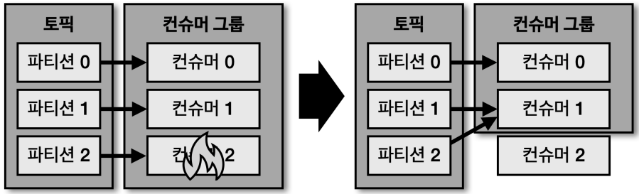

# Consumer

프로듀서에서 send 하게되면, 카프카 클러스터의 토픽에 데이터가 들어오고 이를 활용하는게 컨슈머라고 볼 수 있다.

## Internal

- Fetcher
  - 리더 파티션으로부터 레코드들을 미리 가져와서 대기
  - poll 하기전에 데이터를 가져옴
- poll
  - Fetcher 에 있는 레코드들을 리턴하는 함수
- ConsumerRecords
  - 처리하고자 하는 레코드들의 모음
  - 리스트로 데이터를 데이터를 처리하거나 병렬로도 처리할 수 있다
  - `오프셋이 포함`되어 있음
  - 처리가 완료된 데이터에 대해 커밋을 실행해야한다

## 컨슈머 그룹

- 특정 토픽에 대해 어떤 목적에 따라 데이터를 처리하는 컨슈머들을 묶은 그룹
  - 컨슈머 그룹내 컨슈머는 동일한 로직을 가진다
- 각각의 컨슈머 그룹은 서로 격리된 환경에서 안전하게 운영할 수 있도록 도와준다
- 기본적으로 컨슈머그룹이 `subscribe`를 통해 토픽을 구독하게 되면, 전체 파티션에 대해 데이터를 가져가게 된다

### 컨슈머 그룹 내 컨슈머가 파티션 갯수보다 많은 경우

- 파티션 갯수보다 컨슈머가 많은 경우 유휴상태(Idle)
- 파티션을 할당받지 못했기에 스레드만 차지하고 실제 데이터를 처리하지 못함
  - 즉, 불필요한 스레드
- 따라서, 파티션 갯수만큼만 컨슈머를 띄워주는게 좋음

### 컨슈머 그룹을 활용하는 이유

운영 서버의 주요 리소스인 CPU, 메모리 정보를 수집하는 데이터 파이프라인을 구축한다고 가정

- 카프카를 활용한 파이프라인이 아닌 경우 리소스를 적재하기 위해 동기적으로 데이터를 요청한다
  - 이 경우 동기적인 에이전트들은 하나의 장애가 발생하면 더이상 적재가 불가능해진다
- 카프카를 활용한 경우, 각각의 용도에 따라 서로 다른 컨슈머 그룹으로 데이터를 처리할 수 있다
  - 장애가 발생하더라도 개별적으로 처리가 가능하며, 각 그룹의 오프셋부터 다시 데이터를 적재할 수 있다

### 리밸런싱

리밸런싱이란 토픽에 있는 파티션과 컨슈머 그룹의 컨슈머의 할당이 변경되는 과정이라고 볼 수 있다.

- 일부 컨슈머에 장애가 발생한다면, 매칭된 파티션에 대한 소유권이 정상적인 컨슈머로 넘어간다
- 리밸런싱이 발생하는 상황
  1. 컨슈머가 추가되는 상황
  2. 컨슈머가 제외되는 상황
- 리밸런싱은 데이터 처리 도중 언제든지 발생 가능하기에, 리밸런싱에 대응하는 로직을 작성해야한다
  - RebalanceListener
- 리밸런싱 시간은 토픽 내 파티션 갯수에 의존한다
  - 갯수에 따라 몇 분까지도 리밸런싱이 진행되게, 가능한 리밸런싱이 생기지 않게 운영해야함.

### 커밋

브로커로부터 데이터를 어디까지 가져갔는지 커밋을 통해 기록한다.

- 특정 토픽의 파티션을 어떤 컨슈머 그룹이 어디까지 가져갔는지 `내부 토픽`에 기록됨
  - `__consumer_offsets`
- 컨슈머가 이슈가 발생하고 다시 정상 동작시 데이터 처리의 중복이 발생하지 않도록 한다
- 컨슈머에서 내부 로직을 짤 때 레코드를 처리하고 나면 `반드시 커밋`을 해야한다!

### Assignor

컨슈머와 파티션의 할당 정책.

- RangeAssignor
  - Default
  - 각 토픽에서 파티션을 숫자로 정렬, 컨슈머를 사전 순서로 정렬하여 할당
- RoundRobinAssignor
  - 모든 파티션을 컨슈머에서 번갈아 할당
- StickyAssignor
  - 최대한 파티션을 균등하게 배분
- 사실상, 파티션과 컨슈머는 1:1 매핑해서 운영하기에 크게 상관이 없음.

## 컨슈머의 주요 옵션

### 필수 옵션

- bootstrap.servers
  - 컨슈머가 데이터를 처리할 브로커의 `Hostname:Port`를 1개 이상 작성
  - 2개 이상을 입력하여 일부 브로커에 문제가 생겨도 접속하는데 문제가 없도록 설정
- key.deserializer
  - 레코드의 `메시지 키를 역직렬화`하는 클래스를 지정
- value.deserializer
  - 레코드의 `메시지 값을 역직렬화`하는 클래스를 지정

### 선택 옵션

- group.id
  - 컨슈머 그룹 아이디를 지정
  - `subscribe()` 메서드로 토픽을 구독할 때는 필수 옵션
  - 기본값은 null
- auto.offset.reset
  - 컨슈머 그룹이 파티션을 읽을 때 컨슈머 오프셋이 없는 경우 어느 오프셋 부터 읽을지 선택
    - 컨슈머 오프셋이 없다는 건 한번도 커밋한적이 없는 경우
  - 새로운 컨슈머 그룹을 운용할 때만 활용
  - 기본값은 latest
    - latest
    - 가장 높은(가장 최근에 넣은) 오프셋 부터 읽기 시작
    - earliest
      - 가장 낮은(가장 오래전에 넣은) 오프셋 부터 읽기 시작
    - none
      - 컨슈머 그룹이 커밋한 기록이 있는지 찾아본다
      - 기록이 없다면 오류 반환, 기록이 존재한다면 커밋 기록 이후 부터 읽기 시작
- enable.auto.commit
  - 자동 or 수동 커밋
  - 기본값은 true
- auto.commit.interval.ms
  - 자동 커밋일 경우, 오프셋 커밋 간격
  - 기본값은 5000(5초)
- max.poll.records
  - poll 메서드를 통해 반환되는 최대 레코드 갯수
  - 기본 값은 500
- heartbeat.interval.ms
  - 하트비트를 전송하는 시간 간격
  - 기본값은 3000(3초)
  - `session.timeout.ms`와 함께 컨슈머가 정상적으로 처리되는지 확인할 때 필요
- session.timeout.ms
  - 컨슈머가 브로커와 연결이 끊기는 최대 시간
  - 기본값은 10000(10초)
  - 하트비트가 마지막으로 오고나서 10초가 지나면 문제가 있다고 판단
- max.poll.interval.ms
  - poll 메서드를 호출하는 간격의 최대 시간
  - 기본 값은 30000(5분)
  - poll 메서드가 호출되고 5분이 지나도 poll 이 호출되지 않으면 리밸런싱을 판단하게 됨
- isolation.level
  - 트랜잭션 프로듀서가 레코드를 트랜잭션 단위로 보낼 경우 사용

### auto.offset.rest

컨슈머 오프셋의 존재 여부에 따라 동작하는 방식을 선택하는 옵션이다.

## 멀티 스레드 컨슈머

- 기본적으로 쓰레드 하나당 컨슈머 한개
- 따라서 컨슈머를 여러개 운영하기 위해선
  - 쓰레드를 여러개 가진 프로세스를 한번에 실행하는 방법(Scale up 방식)
    - 여러 개의 쓰레드를 하나의 프로세스에 띄우기 때문에 하나의 쓰레드에 문제가 생기면 문제가 전파됨
    - 프로세스가 하나기 떄문에 배포에 대한 단계가 간소화되는 장점
  - 한 쓰레드당 한개의 프로세스를 가진 프로세스를 여러개 띄워 격리하는 방법
    - 이 방법은 하나의 쓰레드에 문제가 생기더라도 다른 쓰레드에 영향을 끼치지 않는 장점
    - 하지만 쓰레드 하나당 프로세스를 한개 띄우기 떄문에 부담이 존재

## 컨슈머 랙(Consumer Lag)

파티션의 최신 오프셋(LOG-END-OFFSET)과 컨슈머 오프셋(CURRENT-OFFSET) 간의 차이이다.
컨슈머 랙은 컨슈머가 정상 동작하는 여부를 확인할 수 있기에 `필수적으로 모니터링`해야하는 지표이다.

컨슈머 랙은 `컨슈머 그룹과 토픽, 파티션별`로 생성된다.
컨슈머 랙을 모니터링 함으로써 컨슈머의 장애를 확인하고 파티션의 갯수를 정하는데 참고할 수 있다.

- 컨슈머 랙의 발생 원인
  - 프로듀서와 컨슈머의 데이터 처리량의 차이
  - 프로듀서가 보내는 데이터 양 > 컨슈머의 데이터 처리량
    - 컨슈머 랙이 늘어난다
  - 프로듀서가 보내는 데이터 양 < 컨슈머의 데이터 처리량
    - 컨슈머 랙이 줄어 들고 0으로 지연이 없어짐

### 컨슈머 모니터링 - 처리량 이슈

- 프로듀서의 보내는 데이터 양이 늘어날 경우
- 파티션 갯수와 컨슈머 갯수를 늘려 병렬처리량을 늘림

### 컨슈머 모니터링 - 파티션 이슈

- 프로듀서의 보내는 데이터 양은 일정한데 컨슈머의 장애가 발생하는 경우
- 파티션에 할당된 컨슈머 랙의 컨슈머 랙이 늘어나는 상황
  - 해당 컨슈머에 문제가 생겼다

### 컨슈머 랙을 모니터링 확인하는 방법

1. CLI 사용 - kafka-consumer-groups.sh
  - `kafka-consumer-groups.sh --bootstrap-server localhost:9092 --group my-group --describe`
  - 이 방법은 일회성이고 지속적으로 모니터링하기에는 부족
  - 테스트용 카프카에서 주로 사용
2. metrics() 메서드 사용
   - KafkaConsumer 인스턴스의 metrics() 메서드를 통해 컨슈머 랙 지표를 확인 가능
   - 제공 지표
     - records-lag-max
     - records-lag
     - records-lag-avg
   - 사용 이슈
     - 컨슈머가 정상 동작할 경우에만 확인할 수 있음
       - 즉, 컨슈머에 이슈가 생겨 비정상 종료되면 컨슈머 랙 모니터링이 불가
     - 모든 컨슈머에 모니터링 코드를 중복 작성해야 함
       - 자기 자신 컨슈머 그룹에 대한 컨슈머 랙만 한정해서 모니터링하기 때문
     - 카프카 서드 파티 어플리케이션의 컨슈머 랙 모니터링이 불가능
       - fluentd
       - telegraph
       - logstash
3. 외부 모니터링 툴 사용
   - Datadog, Confluent Control Center 와 같은 종합 모니터링 툴 사용
   - 컨슈머 랙 모니터링만을 위한 오픈소스인 Burrow 가 있음

### 카프카 버로우(Burrow)

링크드인에서 개발한 컨슈머 랙 체크 전용 툴로, REST API 를 통해 컨슈머 그룹별로 컨슈머 랙을 확인 가능하다.
Datadog 와 같은 외부 모니터링을 사용하면 클러스에 연결된 모든 정보를 모니터링 가능하지만, 당장 컨슈머를 운영해야하고
컨슈머 랙만을 모니터링하고 싶다면 버로우는 좋은 선택이 될 수 있다.

- 장점
  - 다수의 카프카 클러스터를 동시에 연결하여 컨슈머 랙 확인 가능
    - 비지니스에서는 2개이상의 카프카 클러스터를 구축하여 운영하기에 한번의 설정으로 여러 클러스터의 컨슈머 랙을 확인 가능
  - 컨슈머 랙 이슈 판별(Evaluation)
    - 컨슈머 랙을 단순 임계치로 나타내지 않음
      - 프로듀서가 데이터를 많이 보내면 순간적으로 임계치가 넘어가기도 하기 떄문에 문제가 있다고 보기 어려운 경우도 존재하기에
    - 슬라이딩 윈도우 계산을 통해 상태를 표현
      - 컨슈머 랙과 파티션의 오프셋을 슬라이딩 윈도우로 계산하여 상태가 정해짐
      - OK, WARNING(처리량 이슈), STALLED(커슈머 이슈), STOPPED

