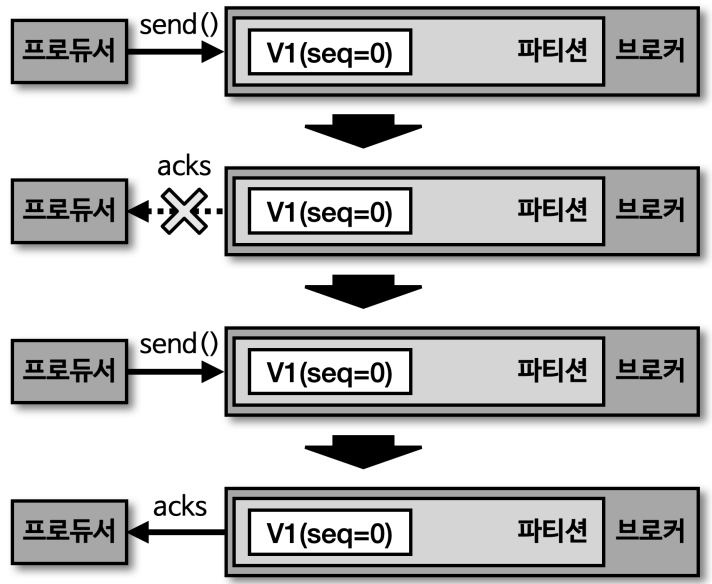

# Idempotence (멱등성)

멱등성이란 여러번 연산을 수행하더라도 동일한 결과를 나타내는 것이다.
그런점에서 멱등성 프로듀서는 동일한 데이터를 여러번 전송하더라도 카프카 클러스터 단 한번만 저장됨을 의미한다.

- 기본 프로듀서의 동작 방식
  - 적어도 한번 전달(at least once delivery)
  - 데이터의 중복 전달이 발생할 수 있음
- 멱등성 프로듀서의 동작 방식
  - 정확히 한번 전달(exactly once)

## 멱등성 프로듀서

데이터의 중복 적재를 막기 위해 프로듀서의 `enable.idempotence` 옵션을 사용하여 정확히 한번 전달을 지원한다.

- 옵션의 기본 값음 false
- 카프카 3.0.0 부터는 기본 값은 true(acks=all)
  - 신규 버전에서 프로듀서의 동작에 유의하여 사용
  - 특히 `acks=all`이기에 특히나 주의를 해야함

### 멱등성 프로듀서의 동작

- 데이터를 브로커로 전달할 때 프로듀서 `PID`와 `시퀀스 넘버`를 함께 전달
  - PID(Producer unique ID)
    - 프로듀서의 공유 ID
  - 시퀀스 넘버(sequence number)
    - 레코드의 전달번호 ID
- 동일한 메시지의 적재 요청이 들어오더라도 단 한번만 적재

### 멱등성 프로듀서의 한계

- 동일한 세션에만 정확히 한번만 전달을 보장
  - 즉, 프로듀서 어플리케이션이 비정상 종료되었을 땐 이를 보장하지 못함
- 동일한 세션이란 PID 의 생명주기를 말하며, 어플리케이션이 재시작하면 PID 가 달라진다
- 브로커에도 부하가 걸림
  - 네트워크를 여러번 받고, PID 와 SID 의 정보도 메모리에 갖고 있어야 함
- 카프카 3.0 에서는 이 부분에서도 많이 최적화가 되어서 멱등성 프로듀서가 true 로 됨.
  - 그렇다고해도 브로커에 부하가 걸리는 건 동일함