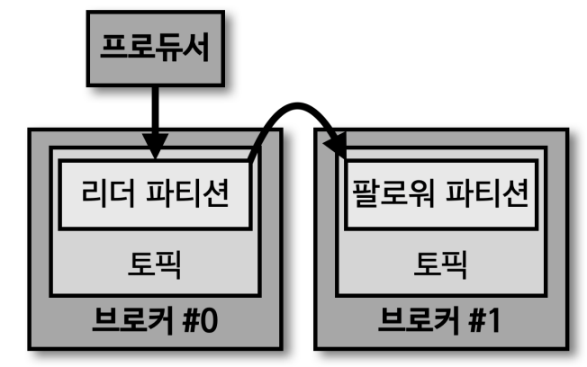

# Producer

데이터 생성의 시작점이며, 카프카에 필요한 데이터를 선언하고 브로커내 특정 토픽의 파티션에 데이터를 전송한다

- 데이터를 전송할 때, `리더 파티션`을 가지고 있는 카프카 브로커와 직접 통신
- 브로커 전송 시, 특정 파티션으로 전송하는 `파티셔너`와 더 많은 데이터 처리량을 위한 `배치 생성 단계` 등을 가진다
- Java 가 공식 라이브러리고 이외 다른 언어의 라이브러리는 비공식이고 따라서 지원하지 않거나 안정적이지 않을 수 있음

## 내부 구조

- ProducerRecord
  - 보낼 데이터에서 정의하는 데이터
  - 프로듀서에 생성하는 데이터이며 `오프셋은 포함하지 않음`
  - 토픽과 메시지 값만 있더라도 데이터를 보내는데 문제는 없음
- send()
  - 레코드를 전송 요청할 수 있게 된다
  - 즉, send 를 호출하자마자 데이터 전송이 바로 진행하는게 아니라는 것!
- Partitioner
  - 어느 파티션으로 전송할지 지정
  - 기본값은 `DefaultPartitioner`로 설정
  - 메시지 키에 따라서 파티셔너가 동작
    - 메시지 키가 같으면 동일한 파티션에 데이터가 쌓인다는 점을 생각하자
- Accumulator
  - 데이터를 전송할 파티션이 정해졌을 때, 배치로 데이터를 묶는 작업을 진행
    - 한번에 최대한 많은 데이터를 보내기 위해
  - 옵션을 활용하여 높은 데이터 처리량을 가질 수 있음

## 프로듀서의 기본 파티셔너

프로듀서 API 를 사용 시, `UniformStickyPartitioner`와 `RoundRobinPartitioner` 를 제공한다.
2.5.0 버전에서는 `UniformStickyPartitioner`를 사용한다.

### 메시지 키가 있을 경우

- 두 파티셔너 모두 메시지 키의 해시값과 파티션을 매칭해서 레코드를 전송
- 동일한 메시지 키가 존재하는 경우 동일한 파티션 번호로 전달
- `파티션 갯수가 변경되는 경우` 메시지 키와 파티션 번호 매칭이 깨짐!!
  - 즉, 갯수가 변경되면 해시 값이 변동되기에 동일한 메시지 키가 다른 파티션으로 가게 될 수도 있다
  - 따라서, 메시지 키를 활용할 경우에는 프로듀서가 보내는 데이터량과 컨슈머가 처리하는 데이터량을 고민하여 파티셔너 갯수를 충분히 늘려 서 사용

### 메시지 키가 없는 경우

- 기본적으로 파티션에 동일하게 분배하는 로직
- RoundRobinPartitioner
  - ProducerRecord 에 들어오는대로 파티션을 순회하며 전송
  - Accumulator 에서 배치로 묶이는 정도가 적기에 전송 성능이 낮음
- UniformStickyPartitioner
  - Accumulator 에서 레코드들이 배치로 묶일 때까지 기다렸다가 전송
  - 배치로 묶이지만, 파티션을 순회하며 보내기 때문에 모든 파티션으로 분배되어 전송
  - RoundRobinPartitioner 에 비해 성능이 향상

### 커스텀 파티셔너

카프카 클라이언트 라이브러리에서는 사용자 지정 파티셔너를 생성하기 위한 `Partitioner Interface를` 제공한다.
사용자 정의 클래스에서 메시지 키 또는 메시지 값에 따른 파티션 지정 로직을 생성하고 적용 가능하다.

## 프로듀서의 주요 옵션

### 필수 옵션

- bootstrap.servers
  - 프로듀서가 데이터를 전송할 브로커의 `Hostname:Port`를 1개 이상 작성
  - 2개 이상을 입력하여 일부 브로커에 문제가 생겨도 접속하는데 문제가 없도록 설정
- key.serializer
  - 레코드의 `메시지 키를 직렬화`하는 클래스를 지정
- value.serializer
  - 레코드의 `메시지 값을 직렬화`하는 클래스를 지정

### 선택 옵션

- acks
  - 프로듀서가 전송한 데이터가 `브로커들`에 정상적으로 저장되었는지 `성공 여부`를 확인할 떄 사용
  - 0, 1, -1(all) 중 하나로 설정할 수 있음
  - 기본 값은 1 이며, 리더 파티션에 데이터가 정상적으로 적재되었음을 확인하는 것
- linger.ms
  - 배치를 전송하기 전까지 기다리는 최소 시간
  - 약간의 지연이 발생할 수 있으나, 데이터 처리량이 늘리고 싶을 때 사용
  - 기본 값은 0
- retries
  - 브로커로부터 에러를 받고 난 후 재전송을 시도하는 횟수
  - 기본 값은 2147473647
- max.in.flight.requests.per.connection
  - 한 번에 요청하는 `최대 커넥션 갯수`
    - `Sender`를 통해 데이터를 보낼 때, 쓰레드가 몇 개인가
    - 설정된 값 만큼 동시에 전달 요청을 수행
  - 기본 값은 5
- partitioner.class
  - 레코드를 파티션에 전송 시의 `파티셔너 클래스를 지정`
  - 기본 값은 DefaultPartitioner
    - 2.5.0 부터는 UniformStickyPartitioner
- enable.idempotence
  - `멱등성 프로듀서`로 동작할지 여부
    - 중복해서 데이터를 보내는 걸 막는 옵션
    - 데이터 전송에 대한 신뢰도를 높일 수 있음
  - 기본 값은 false
- transactional.id
  - 프로듀서가 레코드를 전송할 때 `레코드를 트랜잭션 단위로 묶을지` 여부
  - 기본 값은 null
    - 지정 시, enable.idempotence 가 true 로 됨
    - transaction producer 라고 따로 부르게 됨

## acks 와 ISR(In-Sync-Replicas)

프로듀서가 브로커로 데이터를 보낼 때 어느정도의 신뢰도로 보낼 것이냐에 따라 acks 옵션을 설정할 수 있다.
안전하게 보낼 것이냐 아니면 처리량이 중요하냐와 같은 요구사항에 따라 acks 값을 설정하기에 이 옵션이 중요하다.  
`ISR`은 리더 파티션과 팔로워 파티션의 레코드 오프셋 갯수가 동일할 때를 말한다. 이렇게 sync 가 된 상태여야
두 파티션간에 안전한 fail-over 가 된다고 볼 수 있다.

- 팔로워 파티션이 리더 파티션으로 부터 데이터를 복제하는데 시간이 걸리기 때문에 이를 주의 깊게 봐야한다
  - 이런 복제 시간차 때문에 리더파티션과 팔로워 파티션 간의 오프셋 차이가 발생한다
  - 이 경우 ISR 에는 리더 파티션만 포함되고 팔로워 파티션은 포함이 안된 상태

이때 `acks 옵션 0, 1, all(-1)` 값을 통해 얼마나 신뢰성 높게 데이터를 전송할 지 지정할 수 있다. acks 옵션에 따라서 
신뢰성을 올리고 성능을 낮추거나, 신뢰성을 낮추고 성능을 올릴지 결정할 수 있다. 복제 갯수가 1인 경우 acks 옵션에 따른 성능 변화는 크지 않지만 
안정적인 운영을 위해 복제 갯수가 2인 경우가 대부분이기에 알아둬야하는 옵션이다.

### acks = 0

- 프로듀서가 리더 파티션으로 데이터 전송 시, 리더 파티션으로 `데이터가 저장되었는지 확인하지 않음`
  - `send()`가 호출되면 프로듀서는 응답 값을 받지 않고 바로 OK 한다 
- 가장 속도가 빠르지만 신뢰성이 낮음
- 일부 데이터 유실이 발생하더라도 전송속도가 중요한 경우 사용

### acks = 1

- 프로듀서가 리더 파티션으로 데이터 전송 시, `리더 파티션에만` 저장되었는지 확인
- 리더 파티션으로부터 응답을 받기까지 시간이 걸리기에 성능이 acks=0 에 비해 상대적으로 낮다
- 하지만 복제 갯수가 2 이상인 경우 아직 데이터가 동기화 되지 않을 수 있다는 단점이 존재한다
  - 따라서 일부 데이터가 유실된 가능성이 아직 존재
  - 하지만, 이런 경우는 드믈고 대부분 운영 시 1로 해도 큰 무리가 없음

### acks = all(-1) & min.insync.replicas = 2

- 프로듀서가 리더 파티션으로 데이터 전송 시, `리더와 팔로워 파티션 모두` 저장되었는지 확인
- 당연히 다른 옵션에 비해 성능 및 처리량은 낮지만 신뢰성은 가장 높음
  - 실제 운영 시, 복제 갯수가 많고 데이터 전송이 많은 경우 굉장히 속도가 느림
- 따라서 신뢰도를 극도로 높여야 하는 경우에만 설정
- acks = all 인 경우 min.insync.replicas 옵션에 따라 데이터의 안정성이 달라짐
  - 최소 ISR 갯수
  - 2 만 설정해도 충분
  - 1 인 경우는 리더 파티션만을 확인하는 것이기에 의미가 없음