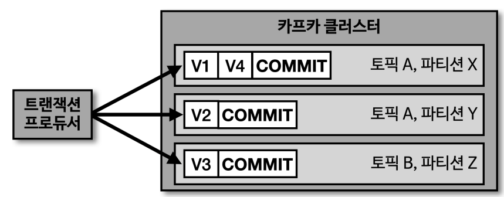
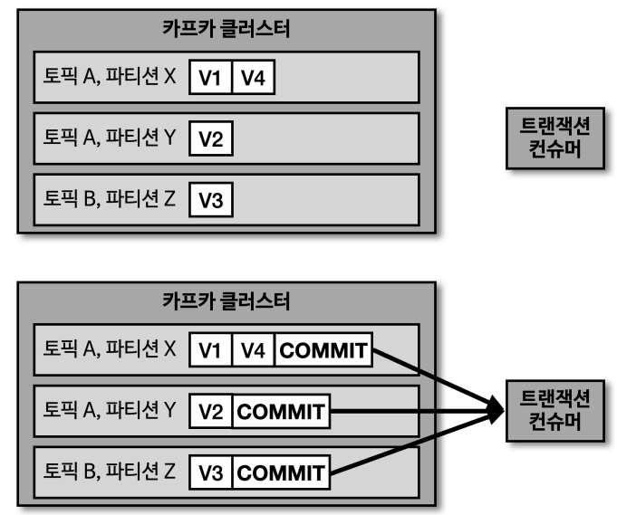

# Transaction Producer & Consumer

## Transaction Producer

- 카프카의 트랜잭션은 다수의 파티션에 데이터를 저장할 경우, 모든 데이터에 대한 동일한 원자성(atomic)을 만족시키키 위해 사용
  - 동일한 데이터를 하나의 트랜잭션을 묶어 전체 데이터를 처리하거나 아니면 전체 데이터를 처리하지 않도록
- 트랜잭션 프로듀서는 데이터를 파티션에 저장할 뿐만 아니라 트랜잭션의 시작과 끝을 표한하기 위해 트랜잭션 레코드를 하나 더 보냄
- 트랜잭션 프로듀서를 사용할 떄는 반드시 커밋을 수행해야 함

### Transaction Producer 설정

- 옵션에서 `transactional.id `설정
  - 단, 프로듀서별로 고유한 ID 값을 설정해야 함
- init, begin, commit 순서대로 수행

## Transaction Consumer

- 트랜잭션 컨슈머는 파티션에 레코드에 존재하더라도 커밋이 없으면 데이터를 가져가지 않음
- 트랜잭션 프로듀서가 커밋을 수행할 때, 트랜잭션 프로듀서가 데이터를 가져가게 됨

### Transaction Consumer 설정

- 옵션에서 `isolation.level 값을 read_committed` 로 설정
  - 커밋이 완료된 레코드들만 읽어서 처리
  - 기본 값은 read_uncommitted

