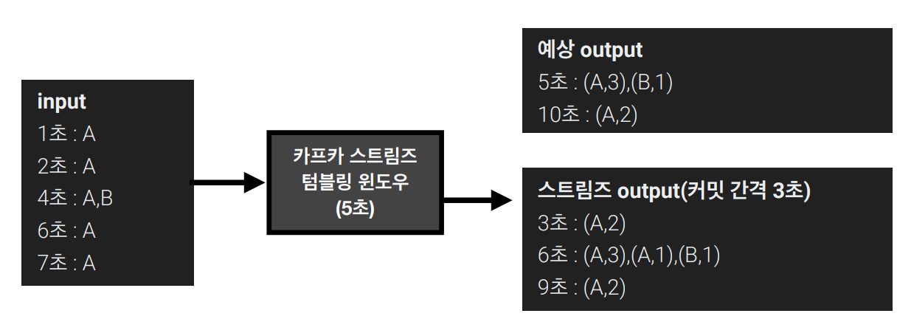

# Streams

토픽에 적재된 데이터를 실시간으로 변환하여 다른 토픽에 적재하는 라이브러리이다.

- 스트림즈 어플리케이션 또는 카프카 브로커에 장애가 발생하더라도 정확히 한번(exactly once)할 수 있도록 장애 허용 시스템을 가짐
  - 데이터 처리 안정성이 뛰어남
- 클러스터를 운영하면서 실시간 스트림 처리가 필요하다면 사용

## 스트림즈를 사용해야하는 이유

- 스트림 데이터 처리에 필요한 `스트림즈DSL`로 제공
  - 필요하다면 프로세서 API를 사용하여 기능을 확장 가능
- 컨슈머와 프로듀서를 조합하여 스트림즈가 제공하는 기능과 유사하게 만드는건 가능
  - 하지만, 단 한번의 데이터 처리, 장애 허용 시스템등의 특징은 완벽히 구현하기 어려움
  - 물론 스트림즈가 제공하지 못하는 기능은 컨슈머와 프로듀서의 조합으로 구현
    - 소스 토픽(사용하는 토픽)과 싱크 토픽(저장하는 토픽)의 카프카 클러스터가 다른 경우

## 스트림즈 내부 구조

- 스트림즈 어플리케이션은 내부적으로 스레드를 1개 이상 생성 가능하며 1개 이상의 테스크를 가짐
  - 테스크는 데이터 처리 최소 단위
- 마치 컨슈머 그룹에 파티션에 1:1 매칭되는 것과 유사하게 운영됨
  - 만약 3개의 파티션으로 이루어진 토픽을 처리하면 내부에 3개의 테스크가 생김
- 스케일 아웃 방식으로 병렬처리를 위해 스레드를 늘림으로써 병렬 처리량을 늘릴 수도 있음

## 토폴로지(Topology), 프로세서와 스트림

- 토폴로지는 2개 이상의 노드들과 선으로 이루어진 집합
  - 스트림즈에서 사용하는 토폴로지는 트리형태와 유사
- 카프카 스트림즈에서는 토폴로지를 이루는 노드를 하나의 `프로세서`라고 부름
- 노드와 노드를 잇는 선을 `스트림`이라고 부른다

### 각 프로세서 설명

- 소스 프로세서
  - 데이터를 처리하기 위해 최초로 선언해야하는 노드
  - 하나 이상의 토픽에서 데이터를 가져오는 역할
- 스트림 프로세서
  - 다른 프로세서가 반환한 데이터를 처리하는 역할
- 싱크 프로세서
  - 데이터를 특정 카프카 토픽으로 저장하는 역할

## StreamsDSL & Processor API

카프카 스트림즈를 구현하는 방식은 크게 두가지 방식이 존재한다

- 스트림즈 DSL
  - 스트림 프로세싱에 쓰일 만한 다양한 기능들을 자체 API로 만들어 놓음
- 프로세서 API
  - 제공하지 않는 기능들은 프로세서 API 를 통해 구현

## StreamDSL

### KStream

- `레코드의 흐름`을 표현한 것
- 메시지 키와 메시지 값으로 구성되어 있음
  - 기본적으로 컨슈머로 토픽을 구독하는 것과 동일한 선상에서 볼 수 있음

### KTable

- 메시지 키를 기준으로 `가장 최신의 메시지 값`만 노출시키는 전략
  - 유일한 메시지 키를 기준으로 가장 최신 레코드를 사용
- 즉, 새로 데이터가 적재되면 동일한 메시지 키에 대해서는 데이터가 업데이트 된다고 볼 수 있음

### Co-partitioning

- `KStream`과 `KTable`을 조인하려면 반드시 코파티셔닝이 되어야 함
- 조인을 하는 `데이터의 파티션 갯수와 파티셔닝 전략`을 동일하게 맞추는 것
  - 이 경우, 동일한 메시지 키를 가진 데이터가 동일한 테스크에 들어가는 것을 보장
- 각 테스크는 KStream 레코드와 KTable 메시지 키가 동일할 경우 조인을 수행 가능
- 코파티셔닝이 되지 않는 경우
  - 파티션 갯수나 파티셔닝 전략이 다른 경우 조인을 수행할 수 없음
  - `TopologyException` 발생

### GlobalKTable

- 코파티셔닝이되지 않는 KStream 과 KTable 을 조인하고 싶다면 KTable 을 `GlobalKTable`로 선언해서 사용
  - GlobalKTable 은 모든 스트림즈 어플리케이션의 모든 테스크에 동일하게 공유되어 사용
- `GlobalKTable`은 모든 테스크에 공유되기에 GlobalKTable 의 데이터가 많을 경우 큰 용량이 필요함
  - 데이터량이 적을 경우 활용하는게 좋음
- 코파티셔닝이 되지 않는 데이터를 조인하는 두가지 방법
  - `리파티셔닝` 수행 후 코파티셔닝이 된 상태로 조인
    - 특정 토픽에 있는 파티션을 조인하고자 하는 파티션의 갯수와 맞춰주는 작업
    - 새로 토픽을 따고 중복해서 데이터가 생성되기 때문에 문제가 됨
  - KTable 로 사용하는 토픽을 `GlobalTable`로 선언하는 방법

### KTable 과 KStream 의 조인

- 스트림과 배치데이터로 사용하는 것과 같다고 볼 수 있음
- 동일한 키에 대해서 메시지 값을 조인해서 데이터를 가져오는 것
- 예시
  - Stream(주문)과 Table(주소)
  - 최신의 주소 데이터와 주문 데이터를 조인하여 데이터를 출력할 수 있음 
- 토픽을 선언하는 것과 KTable, KStream 으로 사용하는 것은 별개
  - KTable 이나 KStream 으로 사용하는 것은 스트림즈의 몫으로 언제든지 바꿔가며 사용 가능

## 스트림즈의 주요 옵션

### 필수 옵션

- bootstrap.servers
  - 프로듀서가 데이터를 전송할 브로커의 `Hostname:Port`를 1개 이상 작성
  - 2개 이상을 입력하여 일부 브로커에 문제가 생겨도 접속하는데 문제가 없도록 설정
- application.id
  - 스트림즈 어플리케이션을 구분하기 위한 고유 아이디
  - 다른 로직을 가진 스트림즈 어플리케이션은 서로 다른 id를 가져야 함

### 선택 옵션

- default.key.serde
  - key 를 직렬화, 역직렬화하는 클래스를 지정
  - 기본값은 바이트 직렬화, 역직렬화 클래스
    - `Serdes.ByteArray().getClass().getName()`
- default.value.serde
  - value 를 직렬화, 역직렬화하는 클래스를 지정
  - 기본값은 바이트 직렬화, 역직렬화 클래스
    - `Serdes.ByteArray().getClass().getName()`
- num.stream.threads
  - 스트림 프로세싱 실행 시 실행될 스레드 갯수
  - 기본값은 1
- state.dir
  - 상태기반 데이터 처리시 데이터를 저장할 디렉토리
    - 데이터 처리시 모두 메모리에 올려서 계산하는게 아니고 파일시스템을 이용
  - 기본값은 /tmp/kafka-streams

## Window Processing

- 특정 시간에 대응하여 취합연산을 처리할 때 활용
- 모든 프로세싱은 메시지 키를 기준으로 취합
- 만약 커스텀 파티셔너를 사용하여 동일한 메시지키가 동일한 파티션에 저장됨을 보장하지 못한다면 사용 불가

### 텀블링 윈도우

- 서로 겹치지 않은 윈도우를 특정 간격으로 지속적으로 처리할 때
  - 데이터베이스에 벌크로 데이터를 저장할 떄 많이 활용됨
  - 매 5분간 접속한 고객의 수를 측정하여 방문자 추이를 취합
- `groupByKey` 와 `windowedBy` 를 사용

### 호핑 윈도우

- 일정 시간 간격으로 겹치는 윈도우가 존재하는 윈도우 연산을 처리할 때
- 동일한 키에 데이터는 서로 다른 윈도우에서 여러번 연산될 수 있음

### 슬라이딩 윈도우

- 호핑 윈도우와 유사하지만 데이터의 `정확한 시간`을 바탕으로 윈도우 사이즈에 포함된 데이터를 모두 연산에 포함시킴
  - 시스템 시간
    - 각각의 레코드에 포함된 `Timestamp`의 정확한 시간을 토대로 연산

### 세션 윈도우

- 동일 메시지 키의 데이터를 한 세션에 묶어 연산할 때
- 세션의 최대 만료시간에 따라 윈도우 사이즈가 달라 짐
  - 윈도우 사이즈가 가변적

### 윈도우 연산시 주의 사항

- 커밋 단위(기본 30초)로 윈도우 연산이 출력
  - 카프카 스트림즈는 커밋 간격마다 처리 완료한 데이터를 출력하기 떄문에
  - 위의 예제로 보면 커밋 간격이 3초라면 예상 결과와 다르게 3초 간격의 결과 값이 출력됨
- 각 윈도우에 맞는 데이터를 출력하고 싶다면 동일한 윈도우 간격을 기준으로 가장 최신 데이터를 가져와야함
  - 겹쳐쓰기(upsert) 방식으로 처리